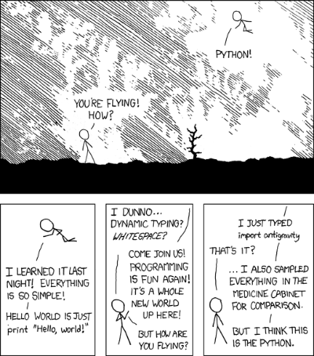

### ITSE-1402 Intermediate Python
Class 2: Python Review
  
##### [https://bit.ly/1402-class2](https://bit.ly/1402-class2)

-----

##### Python Review

##### Caption: "I wrote 20 short programs in Python yesterday.  It was wonderful.  Perl, I'm leaving you." - via [xkcd](https://xkcd.com/353/)

+++++

- [https://app.codesignal.com/](https://app.codesignal.com/)

Note:
We'll be working with a couple different places during our reviewing. Part of it will be in CodeSignal partially to get into the flow of using it and part of it will be from the book. We'll start with the book.

-----

### Chapter 1 - The Way of the Program

+++++

### Exercise 1-1

Note:
We'll start off our review with some basic review of syntax.

+++++

#### Question 1

+++++

<pre class="stretch"><code class="python" data-trim data-noescape>
#!/usr/bin/env python3

# 1. In a print statement, what happens if you leave out 
# one of the parentheses, or both?
</code></pre>

Note:
There is a couple different ways this can play out depending on how you interpret it. 

+++++

<pre class="stretch"><code class="python" data-trim data-noescape>
#!/usr/bin/env python3

# 1. In a print statement, what happens if you leave out
# one of the parentheses, or both?

print'test')
# One parenthesis:
#   File "<stdin>", line 1
#        print'test')
#                  ^
#   SyntaxError: invalid syntax

print 'test'
# Both parentheses (or space and one missing parenthesis):
#   File "<stdin>", line 1
#       print 'test'
#                   ^
#   SyntaxError: Missing parentheses in call to 'print'
</code></pre>

Note:
The difference is in the first part of the question. If you do space and one parenthesis, you get the same answer as the second.

+++++

#### Question 2

+++++

<pre class="stretch"><code class="python" data-trim data-noescape>
#!/usr/bin/env python3

# 2. If you are trying to print a string, what happens if
# you leave out one of you leave out one of the quotation
# marks, or both?
</code></pre>

Note:
Does this one have a similar property to the one before? Or will the answer be the same both ways?

+++++

<pre class="stretch"><code class="python" data-trim data-noescape>
#!/usr/bin/env python3

# 2. If you are trying to print a string, what happens if
# you leave out one of you leave out one of the quotation
# marks, or both?

print('test)
# One quotation
#     File "<stdin>", line 1
#      print('test)
#                   ^
#    SyntaxError: EOL while scanning string literal

print(test)
# Both Quotations
#   Traceback (most recent call last):
#     File "<stdin>", line 1, in <module>
#   NameError: name 'test' is not defined
</code></pre>

Note:
Unlike the other example either parenthesis left out leads to the same result. 

+++++

#### Question 3

+++++

<pre class="stretch"><code class="python" data-trim data-noescape>
#!/usr/bin/env python3

# 3. You can use a minus sign to make a negative number like -2. 
# What happens if you put a plus sign before a number? What
# about 2++2?
</code></pre>
+++++

<pre class="stretch"><code class="python" data-trim data-noescape>
#!/usr/bin/env python3

# 3. You can use a minus sign to make a negative number like -2. 
# What happens if you put a plus sign before a number? What
# about 2++2?

# -2 == -2
# +2 == +2
# 2++2 == 4
</code></pre>

+++++

#### Question 4

+++++

<pre class="stretch"><code class="python" data-trim data-noescape>
#!/usr/bin/env python3

# 4. In math notation, leading zeros are okay, as in 02. What
# happens if you try this in Python?
</code></pre>

+++++

<pre class="stretch"><code class="python" data-trim data-noescape>
#!/usr/bin/env python3

# 4. In math notation, leading zeros are okay, as in 02. What
# happens if you try this in Python?

# 02
#     File "<stdin>", line 1
#       02
#        ^
#   SyntaxError: invalid token
</code></pre>

Note:
In python2 the leading zero makes python interpret it as octal. In python3, it results in a syntax error. 

+++++

#### Question 5

+++++

<pre class="stretch"><code class="python" data-trim data-noescape>
#!/usr/bin/env python3

# 5. What happens if you have two values with no operator between them?
</code></pre>

+++++

<pre class="stretch"><code class="python" data-trim data-noescape>
#!/usr/bin/env python3

# 5. What happens if you have two values with no operator between them?

# No space
#   Traceback (most recent call last):
#     File "<stdin>", line 1, in <module>
#   NameError: name 'ab' is not defined

# Space
#     File "<stdin>", line 1
#       a b
#         ^
#     SyntaxError: invalid syntax
</code></pre>

Note:
Obviously 2 numbers next to each other makes whatver number it is. 5 and 5 = 55. When you do it with two variables, we get different results.

-----

### Chapter 2 - Variables, expressions, and statements

+++++

### Exercise 2-1

Note:

+++++

#### Question 1

+++++

<pre class="stretch"><code class="python" data-trim data-noescape>
#!/usr/bin/env python3

# 1. We've seen that n = 42 is legal. What about 42 = n?
</code></pre>

+++++

<pre class="stretch"><code class="python" data-trim data-noescape>
#!/usr/bin/env python3

# 1. We've seen that n = 42 is legal. What about 42 = n?

# >>> 42 = n
#   File "<stdin>", line 1
# SyntaxError: can't assign to literal
</code></pre>

+++++

#### Question 2

+++++

<pre class="stretch"><code class="python" data-trim data-noescape>
#!/usr/bin/env python3

# 2. How about x = y = 1?
</code></pre>

+++++

<pre class="stretch"><code class="python" data-trim data-noescape>
#!/usr/bin/env python3

# 2. How about x = y = 1?

x=y=1
answer1=x  # 1
answer2=y  # 1
</code></pre>

+++++

#### Question 3

+++++

<pre class="stretch"><code class="python" data-trim data-noescape>
#!/usr/bin/env python3

# 3. In some languages every statement ends with a semicolon, ;. What 
# happens if you put a semicolon at the end of a Python statement? 
# (print some arbitrary value assigned with ';' at the end)
</code></pre>

+++++

<pre class="stretch"><code class="python" data-trim data-noescape>
#!/usr/bin/env python3

# 3. In some languages every statement ends with a semicolon, ;. What 
# happens if you put a semicolon at the end of a Python statement? 
# (print some arbitrary value assigned with ';' at the end)

print(4); # Success!
</code></pre>

+++++

#### Question 4

+++++

<pre class="stretch"><code class="python" data-trim data-noescape>
#!/usr/bin/env python3

# 4. What if you put a period at the end of a statement?
</code></pre>

+++++

<pre class="stretch"><code class="python" data-trim data-noescape>
#!/usr/bin/env python3

# 4. What if you put a period at the end of a statement?

print(4). # SyntaxError: invalid syntax
</code></pre>

-----

### Chapter 3 - Functions

+++++

### Exercise 3-1

Note:

+++++

#### Question 1

+++++

<pre class="stretch"><code class="python" data-trim data-noescape>
#!/usr/bin/env python3

# 1. Write a function named right_justify that takes a string named  
# s as a parameter and prints the string with enough leading spaces  
# so that the last letter of the string is in column 70 of the display.
</code></pre>

+++++

<pre class="stretch"><code class="python" data-trim data-noescape>
#!/usr/bin/env python3

# 1. Write a function named right_justify that takes a string named  
# s as a parameter and prints the string with enough leading spaces  
# so that the last letter of the string is in column 70 of the display.

def right_justify(rstr):
    return ' ' * (70 - len(rstr)) + rstr
answer1=right_justify("monty") # 
</code></pre>

Note:
Can be done with format: 
return "{0:>70}".format(rstr)

+++++

### Exercise 3-2

Note:

+++++

#### Question 1

+++++

<pre class="stretch"><code class="python" data-trim data-noescape>
#!/usr/bin/env python3

# A function object is a value you can assign to a variable or pass   
# as an argument. For example, do_twice is a function that takes a 
# function object as an argument and calls it twice:
#
# def do_twice(f):
#     f()
#     f()
#
# Here's an example that uses do_twice to call a function named  
# print_spam twice:
#
# def print_spam():
#     print('spam')
#     do_twice(print_spam)
#
# Question 1
# 1. Type this example into a script and test it.
</code></pre>

+++++

<pre class="stretch"><code class="python" data-trim data-noescape>
#!/usr/bin/env python3

# A function object is a value you can assign to a variable or pass   
# as an argument. For example, do_twice is a function that takes a 
# function object as an argument and calls it twice:
#
# def do_twice(f):
#     f()
#     f()
#
# Here's an example that uses do_twice to call a function named  
# print_spam twice:
#
# def print_spam():
#     print('spam')
#     do_twice(print_spam)
#
# Question 1
# 1. Type this example into a script and test it.

def do_twice(f):
    f()
    f()
def print_spam():
    print('spam')
    do_twice(print_spam)
print_spam()
# This function causes an infinite loop
</code></pre>

+++++

#### Question 2

+++++

<pre class="stretch"><code class="python" data-trim data-noescape>
#!/usr/bin/env python3

# 2. Modify do_twice so that it takes two arguments, a function 
# object and a value, and calls the function twice, passing the  
# value as an argument.
#
# Hint: you will need rename the function to "do_twice_2"
</code></pre>

+++++

<pre class="stretch"><code class="python" data-trim data-noescape>
#!/usr/bin/env python3

# 2. Modify do_twice so that it takes two arguments, a function 
# object and a value, and calls the function twice, passing the  
# value as an argument.
#
# Hint: you will need rename the function to "do_twice_2"

def do_twice2(f,v):
    f(v)
    f(v)
</code></pre>

+++++

#### Question 3

+++++

<pre class="stretch"><code class="python" data-trim data-noescape>
#!/usr/bin/env python3

# 3. Copy the definition of print_twice from earlier in this chapter  
# to your script.
#
# def print_twice(bruce):
#     print(bruce)
#     print(bruce)
#
</code></pre>

+++++

<pre class="stretch"><code class="python" data-trim data-noescape>
#!/usr/bin/env python3

# 3. Copy the definition of print_twice from earlier in this chapter  
# to your script.

def do_twice2(f,v):
    f(v)
    f(v)

def print_twice(bruce):
    print(bruce)
    print(bruce)
</code></pre>

+++++

#### Question 4

+++++

<pre class="stretch"><code class="python" data-trim data-noescape>
#!/usr/bin/env python3

# 4. Use the modified version of do_twice to call print_twice twice,  
# passing 'spam' as an argument.
</code></pre>

+++++

<pre class="stretch"><code class="python" data-trim data-noescape>
#!/usr/bin/env python3

# 4. Use the modified version of do_twice to call print_twice twice,  
# passing 'spam' as an argument.

def do_twice2(f,v):
    f(v)
    f(v)

def print_twice(bruce):
    print(bruce)
    print(bruce)

do_twice2(print_twice,"spam") # prints spam four times
</code></pre>

+++++

#### Question 5

+++++

<pre class="stretch"><code class="python" data-trim data-noescape>
#!/usr/bin/env python3

# 5. Define a new function called do_four that takes a function object  
# and a value and calls the function four times, passing the value as  
# a parameter. There should be only two statements in the body of this
# function, not four.
</code></pre>

+++++

<pre class="stretch"><code class="python" data-trim data-noescape>
#!/usr/bin/env python3

# 5. Define a new function called do_four that takes a function object  
# and a value and calls the function four times, passing the value as  
# a parameter. There should be only two statements in the body of this
# function, not four.

def do_twice2(f,v):
    f(v)
    f(v)

def print_twice(bruce):
    print(bruce)
    print(bruce)

def do_four(f,v):
    do_twice2(f,v)
    do_twice2(f,v)

do_four(print_twice,"spam")   # print spam 8 times
</code></pre>

+++++

### Exercise 3-3

Note:

+++++

#### Question 1

+++++

<pre class="stretch"><code class="python" data-trim data-noescape>
#!/usr/bin/env python3

# 1. Write a function that draws a grid like the following:
#
# + - - - - + - - - - +
# |         |         |
# |         |         |
# |         |         |
# |         |         |
# + - - - - + - - - - + 
# |         |         | 
# |         |         | 
# |         |         |
# |         |         | 
# + - - - - + - - - - +
</code></pre>

Note:
Focus only on using methods we've talked about so far. Namely print and recursive fuctions

+++++

<pre class="stretch"><code class="python" data-trim data-noescape>
#!/usr/bin/env python3

# 1. Write a function that draws a grid like the following:
#
# + - - - - + - - - - +
# |         |         |
# |         |         |
# |         |         |
# |         |         |
# + - - - - + - - - - + 
# |         |         | 
# |         |         | 
# |         |         |
# |         |         | 
# + - - - - + - - - - +

def print_four(v):
    print(v)
    print(v)
    print(v)
    print(v)
def draw_grid():
    inter=('+ ' + '- ' * 4) * 2 + '+'
    line='|         |         |'
    print(inter)
    print_four(line)
    print(inter)
    print_four(line)
    print(inter)

draw_grid()
</code></pre>

+++++

#### Question 2

+++++

<pre class="stretch"><code class="python" data-trim data-noescape>
#!/usr/bin/env python3

# 2. Write a function that draws a similar grid with four rows and four 
# columns.
</code></pre>

+++++

<pre class="stretch"><code class="python" data-trim data-noescape>
#!/usr/bin/env python3

# 2. Write a function that draws a similar grid with four rows and four 
# columns.

def draw_double_grid():
    inter=('+ ' + '- ' * 4) * 4 + '+'
    line='|         |         |         |         |'
    print(inter)
    print_four(line)
    print(inter)
    print_four(line)
    print(inter)
    print_four(line)
    print(inter)
    print_four(line)
    print(inter)
draw_double_grid()
</code></pre>

-----

### Chapter 5 - Conditionals and Recursion

+++++

### Exercise 5-4

Note:

+++++

#### Question 1

+++++

<pre class="stretch"><code class="python" data-trim data-noescape>
#!/usr/bin/env python3

# 1. What is the output of the following program? Draw a stack
# diagram that shows the state of the program when it prints
# the result.
#
# def recurse(n, s):
#    if n == 0:
#        print(s)
#    else:
#        recurse(n-1, n+s) 
# recurse(3, 0)
</code></pre>

+++++

<pre class="stretch"><code class="python" data-trim data-noescape>
#!/usr/bin/env python3

# 1. What is the output of the following program? Draw a stack
# diagram that shows the state of the program when it prints
# the result.
#
# def recurse(n, s):
#    if n == 0:
#        print(s)
#    else:
#        recurse(n-1, n+s) 
# recurse(3, 0)

"""
recurse:
    n -> 3
    s -> 0
recurse:
    n -> 2
    s -> 3
recurse:
    n -> 1
    s -> 5
recurse:
    n -> 0
    s -> 6

Program prints:
6   
"""
</code></pre>

+++++

#### Question 2

+++++

<pre class="stretch"><code class="python" data-trim data-noescape>
#!/usr/bin/env python3

# 2. What would happen if you called this function like this:
# recurse(-1, 0)?
</code></pre>

+++++

<pre class="stretch"><code class="python" data-trim data-noescape>
#!/usr/bin/env python3

# 2. What would happen if you called this function like this:
# recurse(-1, 0)?

# Continues infinitely
</code></pre>

+++++

<pre class="stretch"><code class="python" data-trim data-noescape>
#!/usr/bin/env python3

# 3. Write a docstring that explains everything someone would
# need to know in order to use this function (and nothing else).
</code></pre>

+++++

<pre class="stretch"><code class="python" data-trim data-noescape>
#!/usr/bin/env python3

# 3. Write a docstring that explains everything someone would
# need to know in order to use this function (and nothing else).

"""
computes value of s
n -> any positive integer
s -> any integer
"""
</code></pre>

-----

### Chapter 6 - Fruitful Functions

+++++

### Exercise 6-1

Note:

+++++

#### Question 1

+++++

<pre class="stretch"><code class="python" data-trim data-noescape>
#!/usr/bin/env python3

# 1. Draw a stack diagram for the following program. What does
# the program print?
#
# def b(z):
#     prod = a(z, z)
#     print(z, prod)
#     return prod
#
# def a(x, y):
#     x = x + 1
#     return x * y
#
# def c(x, y, z):
#     total = x + y + z
#     square = b(total)**2
#     return square
#
# x = 1
# y = x + 1
# print(c(x, y+3, x+y))
</code></pre>

+++++

<pre class="stretch"><code class="python" data-trim data-noescape>
#!/usr/bin/env python3

# 1. Draw a stack diagram for the following program. What does
# the program print?
#
# def b(z):
#     prod = a(z, z)
#     print(z, prod)
#     return prod
#
# def a(x, y):
#     x = x + 1
#     return x * y
#
# def c(x, y, z):
#     total = x + y + z
#     square = b(total)**2
#     return square
#
# x = 1
# y = x + 1
# print(c(x, y+3, x+y))

"""
main:
    x -> 1
    y -> 2
c:
    x -> 1
    y -> 5
    z -> 3
    total ---> 9
    square ---> 8100
b:
    z -> 9
    prod -> 90
a:
    x -> 9
    y -> 9
    x -> 10
 
Prints:
(9, 90)
8100   
"""
</code></pre>

+++++

### Exercise 6-3

Note:

+++++

#### Question 1

+++++

<pre class="stretch"><code class="python" data-trim data-noescape>
#!/usr/bin/env python3

# A palindrome is a word that is spelled the same backward and 
# forward, like  "noon" and "redivider". Recursively, a word is 
# a palindrome if the first and last letters are the same and the 
# middle is a palindrome.
#
# The following are functions that take a string argument and
# return the first, last, and middle letters:
#
# def first(word):
#     return word[0]
#      
# def last(word):
#     return word[-1]
#
# def middle(word):
#     return word[1:-1]
#
# We'll see how they work in Chapter 8.
#
# This allows you to use the functions from palindrome.py for the
# two questions.
#
import palindrome
#
# Question 1
# 1. Type these functions into a file named palindrome.py and 
# test them out. What happens if you call middle with a string
# with two letters? One letter? What about the empty string,
# which is written '' and contains no letters?
</code></pre>

+++++

<pre class="stretch"><code class="python" data-trim data-noescape>
#!/usr/bin/env python3

# A palindrome is a word that is spelled the same backward and 
# forward, like  "noon" and "redivider". Recursively, a word is 
# a palindrome if the first and last letters are the same and the 
# middle is a palindrome.
#
# The following are functions that take a string argument and
# return the first, last, and middle letters:
#
# def first(word):
#     return word[0]
#      
# def last(word):
#     return word[-1]
#
# def middle(word):
#     return word[1:-1]
#
# We'll see how they work in Chapter 8.
#
# This allows you to use the functions from palindrome.py for the
# two questions.
#
import palindrome
#
# Question 1
# 1. Type these functions into a file named palindrome.py and 
# test them out. What happens if you call middle with a string
# with two letters? One letter? What about the empty string,
# which is written '' and contains no letters?

# It prints an empty string.
</code></pre>

+++++

#### Question 2

+++++

<pre class="stretch"><code class="python" data-trim data-noescape>
#!/usr/bin/env python3

import palindrome

# 2. Write a function called is_palindrome that takes a string
# argument and returns True if it is a palindrome and False
# otherwise. Remember that you can use the built-in function 
# len to check the length of a string.
</code></pre>

+++++

<pre class="stretch"><code class="python" data-trim data-noescape>
#!/usr/bin/env python3

import palindrome

# 2. Write a function called is_palindrome that takes a string
# argument and returns True if it is a palindrome and False
# otherwise. Remember that you can use the built-in function 
# len to check the length of a string.

def is_palindrome(word):
    if len(word) <= 1:
        return True
    elif palindrome.first(word) == palindrome.last(word):
        if len(palindrome.middle(word)) == 1:
            return True
        else:
            return is_palindrome(palindrome.middle(word))
    else:
        return False
</code></pre>

-----

### Chapter 8 - Strings

+++++

### Exercise 8-2

Note:

+++++

#### Question 1

+++++

<pre class="stretch"><code class="python" data-trim data-noescape>
#!/usr/bin/env python3

# 1. There is a string method called count that is similar to the  
# function in Section 8.7. Read the documentation of this method  
# and write an invocation that counts the number of a's in 'banana'.
</code></pre>

+++++

<pre class="stretch"><code class="python" data-trim data-noescape>
#!/usr/bin/env python3

# 1. There is a string method called count that is similar to the  
# function in Section 8.7. Read the documentation of this method  
# and write an invocation that counts the number of a's in 'banana'.

word = 'banana'
print(word.count('a'))   # 3
</code></pre>

+++++

### Exercise 8-3

Note:

+++++

#### Question 1

+++++

<pre class="stretch"><code class="python" data-trim data-noescape>
#!/usr/bin/env python3

# 1. A string slice can take a third index that specifies the
# "step size"; that is, the number of spaces between successive
# characters. A step size of 2 means every other character; 3
# means every third, etc.
#
# >>> fruit = 'banana'
# >>> fruit[0:5:2]
# 'bnn'
#
# A step size of -1 goes through the word backwards, so the
# slice [::-1] generates a reversed string. Use this idiom
# to write a one-line version of is_palindrome from Exercise 
# 6.3.
</code></pre>

+++++

<pre class="stretch"><code class="python" data-trim data-noescape>
#!/usr/bin/env python3

# 1. A string slice can take a third index that specifies the
# "step size"; that is, the number of spaces between successive
# characters. A step size of 2 means every other character; 3
# means every third, etc.
#
# >>> fruit = 'banana'
# >>> fruit[0:5:2]
# 'bnn'
#
# A step size of -1 goes through the word backwards, so the
# slice [::-1] generates a reversed string. Use this idiom
# to write a one-line version of is_palindrome from Exercise 
# 6.3.

def is_palindrome(word):
    return word == word[::-1]
</code></pre>

+++++

### Exercise 8-4

Note:

+++++

#### Question 1

+++++

<pre class="stretch"><code class="python" data-trim data-noescape>
#!/usr/bin/env python3

# 1. The following functions are all INTENDED to check whether a
# string contains any lowercase letters, but at least some of them
# are wrong. For each function, describe what the function actually
# does (assuming that the parameter is a string).

def any_lowercase1(s):
    for c in s:
        if c.islower():
            return True
        else:
            return False
print(any_lowercase1("PooP"))

def any_lowercase2(s):
    for c in s:
        if 'c'.islower():
            return 'True'
        else:
            return 'False'

def any_lowercase3(s):
    for c in s:
        flag = c.islower()
    return flag

def any_lowercase4(s):
    flag = False
    for c in s:
        flag = flag or c.islower()
    return flag

def any_lowercase5(s):
    for c in s:
        if not c.islower():
            return False
    return True
</code></pre>

+++++

<pre class="stretch"><code class="python" data-trim data-noescape>
#!/usr/bin/env python3

# 1. The following functions are all INTENDED to check whether a
# string contains any lowercase letters, but at least some of them
# are wrong. For each function, describe what the function actually
# does (assuming that the parameter is a string).

def any_lowercase1(s):
    # Checks only first letter in string if it is lowercase or not 
    # and returns boolean.
    for c in s:
        if c.islower():
            return True
        else:
            return False
print(any_lowercase1("PooP"))

def any_lowercase2(s):
    # Checks if string 'c' is lowercase or not; and returns string
    #  'True'; Returns 'True' everytime, given argument does not
    # matter;
    for c in s:
        if 'c'.islower():
            return 'True'
        else:
            return 'False'

def any_lowercase3(s):
    # Checks if each letter in string is lowercased or not and 
    # assigned the outcome (boolean value) to the variable 'flag'; 
    # new value is assigned to 'flag' with every checked letter;
    # Returns boolean value of calling islower() method on only 
    # the last letter of the given string;
    for c in s:
        flag = c.islower()
    return flag

def any_lowercase4(s):
    # Checks if there is ANY lowercased letter in given string
    # and returns boolean;
    flag = False
    for c in s:
        flag = flag or c.islower()
    return flag

def any_lowercase5(s):
    # Checks every letter if it is not lowercased and returns
    # boolean if all the letters in string are lowercased or not;
    for c in s:
        if not c.islower():
            return False
    return True
</code></pre>

+++++

### Exercise 8-5

Note:

+++++

#### Question 1

+++++

<pre class="stretch"><code class="python" data-trim data-noescape>
#!/usr/bin/env python3

# A Caesar cypher is a weak form of encryption that involves 
# "rotating" each letter by a fixed number of places. To rotate a
# letter means to shift it through the alphabet, wrapping around to
# the beginning if necessary, so 'A' rotated by 3 is 'D' and 'Z'
# rotated by 1 is 'A'. To rotate a word, rotate each letter by the
# same amount. For example, "cheer" rotated by 7 is "jolly" and 
# "melon" rotated by -10 is "cubed". In the movie 2001: A Space 
# Odyssey, the ship computer is called HAL, which is IBM rotated 
# by -1.
#
# Question 1
# 1. Write a function called rotate_word that takes a string and an
# integer as parameters, and returns a new string that contains the 
# letters from the original string rotated by the given amount.
#
# You might want to use the built-in function ord, which converts
# a character to a numeric code, and chr, which converts numeric codes
# to characters. Letters of the alphabet are encoded in alphabetical
# order, so for example:
#
# >>> ord('c') - ord('a')
# 2
#
# Because 'c' is the two-eth letter of the alphabet.
#
# But beware: the numeric codes for upper case letters are different.
#
# Potentially offensive jokes on the Internet are sometimes encoded
# in ROT13, which is a Caesar cypher with rotation 13. If you are 
# not easily offended, find and decode some of them.
</code></pre>

+++++

<pre class="stretch"><code class="python" data-trim data-noescape>
#!/usr/bin/env python3

# A Caesar cypher is a weak form of encryption that involves 
# "rotating" each letter by a fixed number of places. To rotate a
# letter means to shift it through the alphabet, wrapping around to
# the beginning if necessary, so 'A' rotated by 3 is 'D' and 'Z'
# rotated by 1 is 'A'. To rotate a word, rotate each letter by the
# same amount. For example, "cheer" rotated by 7 is "jolly" and 
# "melon" rotated by -10 is "cubed". In the movie 2001: A Space 
# Odyssey, the ship computer is called HAL, which is IBM rotated 
# by -1.
#
# Question 1
# 1. Write a function called rotate_word that takes a string and an
# integer as parameters, and returns a new string that contains the 
# letters from the original string rotated by the given amount.
#
# You might want to use the built-in function ord, which converts
# a character to a numeric code, and chr, which converts numeric codes
# to characters. Letters of the alphabet are encoded in alphabetical
# order, so for example:
#
# >>> ord('c') - ord('a')
# 2
#
# Because 'c' is the two-eth letter of the alphabet.
#
# But beware: the numeric codes for upper case letters are different.
#
# Potentially offensive jokes on the Internet are sometimes encoded
# in ROT13, which is a Caesar cypher with rotation 13. If you are 
# not easily offended, find and decode some of them.

def rotate_letter(letter, n):
    if letter.isupper():
        start = ord('A')
    elif letter.islower():
        start = ord('a')
    else:
        return letter

    c = ord(letter) - start
    i = (c + n) % 26 + start
    return chr(i)

def rotate_word(word, n):
    res = ''
    for letter in word:
        res += rotate_letter(letter, n)
    return res

print(rotate_word("cheer", 7))
print(rotate_word("IBM", -1))
</code></pre>

-----

### CodeSignal Arcade Pratice

+++++

#### Intro
- 1     add
- 2     centuryFromYear
- 3     checkPalindrome

#### The Core
- 1     Add Two Digits
- 2     Largest Number
- 3     Candies
- 4     Seats in Theater
- 5     Max Multiple

+++++

### Python
- 1     Collections Truthness
- 2     Efficient Comparison
- 3     Special Conditional
- 4     Language Differences

- 11    String Definition
- 12    Fix Message
- 13    Cat Walk
- 14    Convert Tabs
- 15    Feedback Review
- 16    Is Word Palindrome
